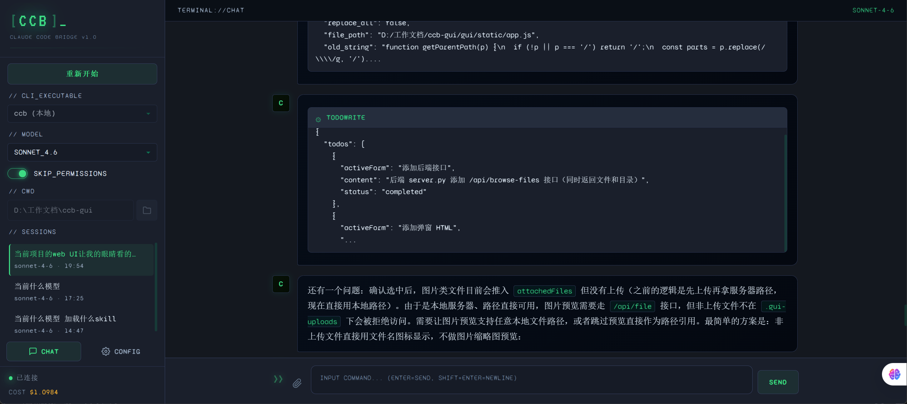

# CC Bridge

> 把 `ccb` / `claude` Claude Code CLI 变成一个更顺手、更可视化的本地 Web 控制台。

CC Bridge 是一个轻量级 Web GUI，用浏览器桥接 Claude Code CLI：保留 CLI 的会话体系和 `stream-json` 能力，同时提供流式聊天界面、历史会话、附件、模型/CLI 切换、Agent/Skill 选择、远程诊断和清晰的运行状态。

服务端只使用 **Python 标准库**，前端是 **静态 HTML / CSS / Vanilla JavaScript**，没有数据库、没有 Web 框架、没有前端构建步骤。项目优先面向 Windows 本机使用，也可用 `python server.py` 跨平台运行。



---

## 功能特性

- **流式对话**：通过 SSE 接收 Claude Code `stream-json` 输出，实时展示回复、工具调用、思考块和错误状态。
- **历史会话**：按工作目录分组展示会话，支持新建、恢复、重命名、删除、置顶和继续上下文。
- **模型与 CLI 切换**：自动检测同目录 / 上级目录的 `ccb.exe`、PATH 中的 `ccb` 和 `claude`，模型列表从 Claude 配置中读取。
- **文件上下文**：支持附件上传、拖拽、目录浏览、文件搜索和上传文件预览。
- **Slash Commands / Skills / Agents**：从 CLI 初始化事件读取 slash commands、skills、agents；支持输入 `/` 选择命令、输入 `@` 提及自定义 Agent。
- **会话成员与观察者模式**：同一会话可被多个浏览器标签页实时查看；消息发起者可以中断/停止，观察者只读。
- **费用与 Token 展示**：读取 CLI `result` 事件中的费用和 token 用量，并按会话累计展示。
- **配置管理**：可编辑 Claude settings/env、GUI 偏好、MCP server、环境变量 profile、自定义 Agent 等配置。
- **远程诊断**：通过 SSH 远程目标和 `remote_bridge.py` 暴露 MCP 工具，默认只读，写入能力需显式开启。
- **项目记忆检索**：为 Claude Code auto memory 文件建立本地 SQLite FTS5 索引，便于在 GUI 中搜索和维护记忆。
- **零重依赖**：后端基于 `asyncio.start_server` 手写 HTTP / REST / SSE / multipart 处理，前端直接由静态文件提供。

---

## 快速开始

### 前置条件

- Python 3.10+
- 已安装并可用的 `claude` 或 `ccb` CLI
- 已完成 Claude Code 所需认证或 API Key 配置

### 启动

Windows：

```bat
start.bat
```

跨平台：

```bash
python server.py
```

服务默认从端口 `17878` 启动；如果端口被占用，会自动递增尝试下一个可用端口。启动后终端会打印本机访问地址，例如：

```text
[CC Bridge] Server running at http://127.0.0.1:17878
[CC Bridge] LAN access: http://192.168.x.x:17878
```

在浏览器打开终端打印的 `127.0.0.1` 地址即可使用。服务当前监听所有网卡；局域网访问可在 GUI 设置中控制。默认不会自动打开浏览器，如需启动后自动打开，可设置环境变量 `CCB_GUI_OPEN_BROWSER=1` 后再运行 `python server.py`。

---

## 基本使用

1. 在侧栏确认当前工作目录。
2. 如需调整命令行工具、模型、权限模式或远程目标，展开“运行设置”。
3. 点击“新建会话”开始输入消息，或从历史列表恢复已有会话。
4. 输入 `/` 打开 slash command 面板；输入 `@` 搜索并选择自定义 Agent。
5. 拖拽文件到输入框或使用文件选择器添加附件。
6. 点击顶部 Session ID 可复制 `<cli> --resume <session-id>`，便于回到终端继续。
7. 会话生成中，其他标签页进入同一会话会以观察者身份实时查看输出。
8. 如需远程诊断，在设置中添加远程目标并在会话中绑定；默认远程工具只读。

说明：

- GUI 只展示 CLI `system/init` 元数据中可发现的 slash commands；终端 TUI 本地实现的命令不一定可用。
- “中断/停止”只影响当前生成；已捕获的 CLI session id 会保留，可继续恢复。
- 恢复历史会话后仍可切换模型，下一条消息会带上新的模型参数并通过 `--resume` 继续原会话。
- 页面重新获得焦点时会刷新本机 CLI、模型、settings 和 slash command 缓存。

---

## 配置与持久化

| 内容 | 位置 |
|------|------|
| GUI 偏好设置（主题、语言、字体大小、局域网访问等） | `~/.ccb/gui_settings.json` |
| 环境变量 profiles | `~/.ccb/env_profiles.json` |
| 远程目标配置 | `~/.ccb/remote_targets.json` |
| 远程目标粘贴私钥 | `~/.ccb/keys/` |
| 远程 MCP 临时配置 | `~/.ccb/mcp/` |
| 远程操作审计日志 | `~/.ccb/remote_audit.log` |
| 项目记忆全文索引 | `~/.ccb/memory_index/` |
| GUI 会话索引、累计费用与 token | `~/.claude/gui_sessions.json` |
| GUI 隐藏会话记录 | `~/.claude/gui_hidden_sessions.json` |
| Claude 全局 settings / env / MCP | `~/.claude/settings.json` |
| 旧版 Claude 全局/项目 MCP 配置来源 | `~/.claude.json` |
| 全局自定义 Skill 定义 | `~/.claude/skills/*/SKILL.md` |
| 全局自定义 Agent 定义 | `~/.claude/agents/*.md` |
| 项目级自定义 Agent 定义 | `<工作目录>/.claude/agents/*.md` |
| Claude Code 原始会话 JSONL | `~/.claude/projects/<sanitized-cwd>/*.jsonl` |
| Claude Code auto memory 文件 | `~/.claude/projects/<sanitized-cwd>/memory/*.md` |
| 工作目录附件缓存 | `<工作目录>/.gui-uploads/`（不可用时回退到 `uploads/`） |

界面文案位于：

```text
static/i18n/en.json
static/i18n/zh.json
```

两份文件使用同一组 key，页面通过 `data-i18n`、`data-i18n-placeholder`、`data-i18n-title` 读取当前语言对应的文案。

---

## 目录结构

```text
cc-bridge/
├── server.py             # HTTP 静态服务、REST API、SSE、上传和路由
├── ccb_bridge.py         # CLI 检测、子进程管理、stream-json 解析、会话续接
├── config_manager.py     # Claude settings/env、GUI 偏好、MCP、Skill、Agent 配置
├── session_store.py      # 会话索引、标题、CWD 更新、费用/token 累计、历史读取
├── remote_manager.py     # 远程目标配置、SSH 连接测试、远程文件缓存
├── remote_bridge.py      # 供 CLI 调用的远程 MCP 工具桥接
├── memory_index.py       # auto memory 文件索引与 SQLite FTS5 搜索
├── start.bat             # Windows 启动脚本
├── static/
│   ├── index.html        # 页面结构
│   ├── app.js            # 前端交互逻辑
│   ├── style.css         # 样式
│   └── i18n/             # 中英文文案
├── docs/
│   └── preview.png       # README 预览图
└── README.md
```

---

## API 概览

主要接口均由 `server.py` 提供：

| 方法 | 路径 | 说明 |
|------|------|------|
| GET | `/` | 主页面 |
| GET | `/sse?id=...` | SSE 事件流 |
| POST | `/api/action` | 会话动作：新建、恢复、发送消息、中断、停止 |
| POST | `/api/upload` | 上传附件到工作目录缓存 |
| GET/POST | `/api/settings` | 读取/保存 Claude settings |
| GET/POST | `/api/gui-settings` | 读取/保存 GUI 偏好 |
| GET/POST | `/api/env` | 读取/保存 Claude env 配置 |
| GET/POST | `/api/env-profiles` | 读取/保存环境变量 profile |
| GET/POST | `/api/mcp-servers` | 列出/保存 MCP server 配置 |
| GET | `/api/skills` | 列出本地 skills |
| GET/POST | `/api/agents` | 列出/创建自定义 agents |
| POST | `/api/agents/update` | 更新自定义 agent |
| POST | `/api/agents/delete` | 删除自定义 agent |
| GET/POST | `/api/session/agents` | 读取/设置当前会话 agents |
| GET | `/api/models` | 从 Claude 配置读取模型列表 |
| GET | `/api/slash-commands` | 从 CLI 初始化事件读取 slash commands / skills / agents |
| GET/POST | `/api/clis` | 检测/切换当前 CLI |
| GET | `/api/check-update` | 检查 `origin/master` 是否有更新 |
| POST | `/api/update` | 拉取更新 |
| POST | `/api/restart` | 重启本地服务进程 |
| POST | `/api/install-cli` | 调用 CLI 安装脚本 |
| GET | `/api/default-cwd` | 获取默认工作目录 |
| GET | `/api/sessions` | 列出历史会话 |
| POST | `/api/sessions/history` | 读取指定会话历史 |
| POST | `/api/sessions/delete` | 隐藏/删除会话索引 |
| POST | `/api/sessions/rename` | 重命名会话标题 |
| POST | `/api/sessions/update-cwd` | 更新会话工作目录 |
| POST | `/api/sessions/toggle-pin` | 置顶/取消置顶会话 |
| GET | `/api/file?path=...` | 预览允许范围内的上传文件 |
| POST | `/api/upload/delete` | 删除上传附件 |
| POST | `/api/browse` | 浏览目录，仅返回子目录 |
| POST | `/api/browse-files` | 浏览目录，返回文件和子目录 |
| POST | `/api/search-files` | 搜索当前目录及子目录中的文件 |
| POST | `/api/mkdir` | 创建目录 |
| GET/POST | `/api/remote-targets` | 列出/保存远程目标 |
| POST | `/api/remote-targets/delete` | 删除远程目标 |
| POST | `/api/remote-targets/test` | 测试远程连接 |
| POST | `/api/remote-files/list` | 浏览远程文件 |
| POST | `/api/remote-files/cache` | 缓存远程文件为附件 |
| GET/POST | `/api/memory/files` | 列出/创建 memory 文件 |
| GET/POST | `/api/memory/search` | 搜索 memory 文件 |
| GET/POST | `/api/memory/index` | 建立或刷新 memory 索引 |
| POST | `/api/memory/file` | 读取 memory 文件 |
| POST | `/api/memory/update` | 更新 memory 文件 |
| POST | `/api/memory/delete` | 删除 memory 文件 |
| GET | `/api/review` | 查看工作区变更摘要 |

---

## 技术说明

- **标准库后端**：`asyncio.start_server` 手写 HTTP 服务，静态文件、REST、SSE、multipart 上传都在 `server.py` 中处理。
- **静态前端**：`static/index.html`、`static/app.js`、`static/style.css` 直接运行，无 npm、打包器或构建产物。
- **SSE 通信**：浏览器使用 EventSource 接收服务端事件，心跳保持连接，避免额外 WebSocket 依赖。
- **CLI 子进程模型**：普通会话优先复用一个 `--input-format stream-json` 的持久 CLI 子进程；工作目录、模型、权限、远程目标或 Agent 配置变化会触发进程重启并继续会话。如果持久模式不可用，会自动回退到每条消息一个子进程并通过 `--resume <session_id>` 续接上下文。
- **session_id 捕获**：从 CLI 事件中捕获真实 session id，并持久化到 GUI 会话索引，后续恢复使用 `--resume`。
- **事件过滤与累计**：服务端只把允许的事件推给前端，并从 `result` 事件累计费用和 token。
- **安全边界**：静态文件和上传文件预览都有路径穿越保护；目录浏览和搜索会跳过 dotfiles、`.git`、`node_modules`、`__pycache__`、虚拟环境等目录。
- **局域网访问控制**：服务监听所有网卡并打印 LAN URL；非 localhost 客户端是否可继续驱动本地 CLI 由 GUI 设置控制。
- **远程诊断**：远程目标默认使用系统 `ssh`，目标机器只需 SSH 服务；粘贴私钥会落地到 `~/.ccb/keys/` 并尽量收紧权限。

---

## License

MIT
