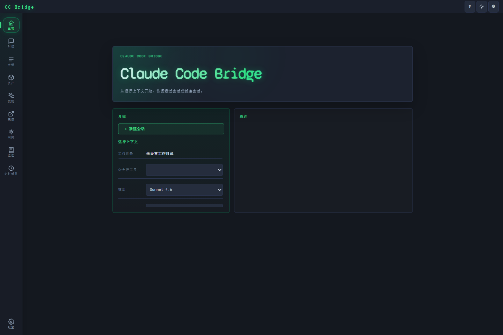
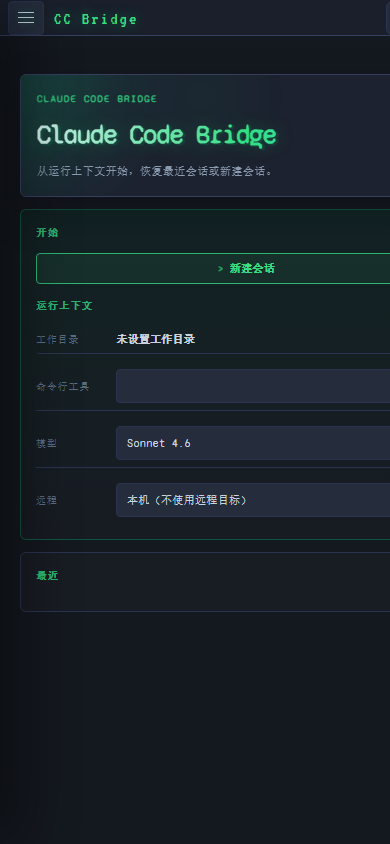

# CC Bridge

CC Bridge 是一个面向 Claude Code 使用者的本地可视化界面。

它把你已经在使用的 `claude` / `ccb` 命令行体验，扩展成一个更适合日常工作的桌面端与浏览器界面：可以聊天、恢复历史会话、管理工作目录、添加文件上下文、切换模型、查看费用与 Token，并在电脑和手机上同步观察同一个会话。

> CC Bridge 不替代 Claude Code CLI，而是为它提供一个更易用的本地 GUI。

## 预览

### 桌面端



### 移动端



## 为什么使用 CC Bridge

Claude Code CLI 很适合在终端中高效完成开发任务，但在一些场景下，图形界面会更方便：

- 想同时查看多个历史会话，不想反复查找 session id。
- 想把文件、截图、上下文拖进对话，而不是手动拼接路径。
- 想在手机或另一台设备上观察当前 Claude Code 的输出。
- 想更直观地切换模型、权限模式、工作目录、Agent、Skill 或命令。
- 想通过网关能力统一接入和管理不同的 Claude Code 使用入口。
- 想沉淀项目知识、LLM Wiki 与记忆内容，并以可视化方式查看和维护。
- 想保留 Claude Code CLI 的原生能力，同时获得更清晰的会话管理体验。

CC Bridge 的目标是：让 Claude Code 的日常使用更直观、更连续、更适合多会话工作流。

## 适合的使用场景

### 日常编码

在项目目录中启动 CC Bridge，选择工作目录后直接与 Claude Code 对话。你可以让它阅读代码、修改文件、解释报错、规划任务或继续已有会话。

### 多会话管理

在侧边栏中查看、恢复、重命名、置顶或删除历史会话。适合同时维护多个项目、多个任务分支或多个上下文。

### 网关入口

通过网关能力统一连接本地 Claude Code CLI、桌面端和浏览器界面，让不同使用入口共享同一套本地服务与会话上下文。

### LLM Wiki 与记忆可视化

把项目知识、常用上下文、会话沉淀和记忆内容整理成更容易浏览的可视化资料，帮助团队或个人快速理解项目背景、关键决策和常见工作流。

### 文件与上下文整理

通过拖拽或附件按钮加入文件上下文，也可以在界面中浏览和搜索本地文件，减少手动复制路径和内容的成本。

### 移动端查看

在同一局域网内用手机浏览器打开 CC Bridge，可以查看当前会话输出。适合在运行长任务时离开电脑但仍想观察进度。

### 桌面化使用

如果你更喜欢固定应用窗口，可以使用桌面端。桌面端会以独立应用形式承载 CC Bridge，减少浏览器标签页干扰。

## 快速开始

### 前置条件

推荐直接使用启动脚本。启动脚本会尽量帮助你检查运行环境。

如果你选择手动启动，请确保已准备好：

- Python 3.10 或更高版本
- 已安装并可用的 Claude Code CLI：`claude` 或 `ccb`
- 已完成 Claude Code 登录、认证或 API Key 配置

### Windows

在项目目录中双击或运行：

```bat
start.bat
```

### macOS / Linux

在项目目录中运行：

```bash
chmod +x start.sh
./start.sh
```

### 已配置环境

如果你的 Python 和 Claude Code CLI 已经可用，也可以直接运行：

```bash
python bootstrap.py
```

或：

```bash
python server.py
```

启动后，终端会显示本地访问地址，例如：

```text
http://127.0.0.1:17878
```

如果默认端口被占用，CC Bridge 会自动尝试下一个可用端口。

## 基本使用方式

1. 启动 CC Bridge。
2. 打开终端中显示的访问地址。
3. 在左侧创建新会话，或恢复已有会话。
4. 选择工作目录、模型、权限模式等运行设置。
5. 在输入框中向 Claude Code 发送任务。
6. 需要时拖拽文件或添加附件作为上下文。
7. 如果想回到终端继续同一会话，可以复制 Session ID 并使用 Claude Code CLI 的 resume 能力。

## 桌面端

CC Bridge 提供 Electron 桌面端，适合希望以独立应用窗口使用的用户。

### 开发模式运行桌面端

```bash
npm run desktop:dev
```

### 打包桌面端

常用命令：

```bash
npm run package:desktop
```

仅打包目录：

```bash
npm run package:desktop:pack
```

生成发布包：

```bash
npm run package:desktop:release
```

也可以使用 Electron Builder 脚本：

```bash
npm run desktop:pack
npm run desktop:dist
npm run desktop:dist:win
```

> 桌面端仍然使用本机的 CC Bridge 服务和 Claude Code CLI。请先确保本机环境可正常运行。

## 主要能力

### 可视化聊天

以聊天界面使用 Claude Code，实时查看输出、工具调用、错误信息和完成状态。

### 历史会话

自动读取并展示 Claude Code 会话。你可以恢复之前的任务，也可以对会话进行重命名、置顶、删除或切换工作目录。

### 工作目录管理

每个会话都可以绑定工作目录。适合在多个代码项目之间切换，减少手动进入目录和复制路径的操作。

### 模型与权限模式切换

在界面中选择可用模型和运行权限模式，更方便地控制当前任务的执行方式。

### 文件附件

支持通过拖拽或按钮添加文件上下文。适合让 Claude Code 阅读日志、配置、代码片段、截图说明或其他项目资料。

### Slash Commands、Skills 与 Agents

可以在输入时快速选择可用命令、Skill 或 Agent，让常用工作流更容易触发。

### 网关能力

提供统一的本地访问入口，让桌面端、浏览器端和 Claude Code CLI 更自然地协同使用。你可以在不同设备或界面之间切换，同时保留本地运行和本地会话管理的特性。

### LLM Wiki

支持把项目说明、使用经验、上下文资料和会话结论沉淀为面向 LLM 的知识资料。它可以作为团队协作时的项目 Wiki，也可以作为个人长期维护项目时的上下文索引。

### 记忆可视化

将长期记忆、项目背景、偏好设置和关键上下文以更直观的方式展示出来，方便查看、理解和维护，让后续会话更容易延续已有认知。

### 多端观察

同一个会话可以在多个浏览器标签页或移动设备上打开，用于观察当前输出和运行状态。

### 远程目标

可以配置远程目标，让 Claude Code 通过 SSH / MCP 等能力操作另一台机器。

需要注意：CC Bridge 和 Claude Code CLI 仍运行在本机；远程目标只是任务操作对象，不代表把整个会话运行到远程机器上。

### 配置管理

可以在界面中管理部分 Claude Code 相关配置，例如环境变量、MCP、GUI 偏好、Agent 等。

### 费用与 Token 展示

会话中会展示 Claude Code 返回的费用和 Token 信息，便于了解每次任务的大致消耗。

### 移动端适配

界面对手机浏览器做了适配，方便在局域网内查看会话和输出状态。

## 常见问题

### CC Bridge 会把我的代码上传到额外的服务器吗？

不会。CC Bridge 是本地运行的界面，负责连接你本机的 Claude Code CLI。

实际与 Claude 服务交互的仍然是你本机配置的 `claude` / `ccb` 命令行工具。请按照 Claude Code 本身的使用规则和隐私策略管理你的项目内容。

### 我必须安装桌面端吗？

不必须。

你可以直接用浏览器访问本地地址，例如：

```text
http://127.0.0.1:17878
```

桌面端只是提供一个独立应用窗口，适合更偏好桌面应用体验的用户。

### Windows 上应该运行哪个命令？

推荐运行：

```bat
start.bat
```

这是 Windows 用户最简单的入口。

### macOS / Linux 上应该运行哪个命令？

推荐运行：

```bash
./start.sh
```

如果没有执行权限，先运行：

```bash
chmod +x start.sh
```

### 已经安装好 Python 和 Claude Code CLI，还需要 bootstrap 吗？

不一定。

你可以直接运行：

```bash
python server.py
```

如果希望使用项目提供的环境检查和启动流程，可以运行：

```bash
python bootstrap.py
```

### 为什么端口不是 17878？

CC Bridge 默认从 `17878` 开始尝试启动。如果该端口已被其他程序占用，会自动递增到下一个可用端口。

请以终端实际输出的地址为准。

### 手机怎么访问？

确保手机和电脑在同一个局域网内，然后在手机浏览器打开终端中显示的 LAN 地址，例如：

```text
http://192.168.x.x:17878
```

如果无法访问，请检查：

- 电脑和手机是否在同一网络。
- 防火墙是否拦截了本地服务端口。
- 终端中显示的地址和端口是否正确。

### CC Bridge 可以替代 Claude Code CLI 吗？

不建议这样理解。

CC Bridge 是 Claude Code CLI 的图形界面补充。它依赖你本机已安装并可用的 `claude` 或 `ccb`，并保留 Claude Code 的会话和命令行能力。

你仍然可以随时回到终端继续使用 Claude Code CLI。

### 如何继续一个已有会话？

在左侧会话列表中选择历史会话即可恢复。

如果你想在终端中继续同一会话，可以复制界面中的 Session ID，然后使用 Claude Code CLI 的 resume 方式继续。

### 远程目标是不是把 CC Bridge 安装到远程服务器？

不是。

远程目标表示让 Claude Code 操作远程机器。CC Bridge 服务、浏览器界面和 Claude Code CLI 仍然运行在你的本机。

### 启动失败怎么办？

可以按顺序检查：

1. Python 是否安装并可用。
2. `claude` 或 `ccb` 命令是否可用。
3. Claude Code 是否已完成登录或认证。
4. 当前端口是否被安全软件或防火墙拦截。
5. 终端中是否有明确错误提示。

如果你使用的是 Windows，优先尝试重新运行：

```bat
start.bat
```

如果你使用的是 macOS / Linux，优先尝试：

```bash
./start.sh
```

## License

MIT
